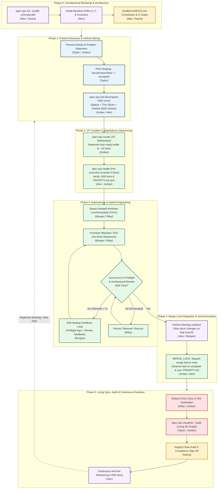

# Explanation: The SpecOps Project & Product Lifecycle

> **A Persona-Driven Analysis of Project Management as Code (PMaC) Across the Software Development Lifecycle.**

---

## 1. Architectural Philosophy: The Living Cybernetic Loop

In traditional software development, project management tools (Jira, Linear) and source code repositories operate in separate worlds. This separation leads to **specification drift**, **the silo of mocked perfection**, and **multi-agent git merge contention**.

SpecOps replaces external tracking tools with **Project Management as Code (PMaC)**:
- Specifications, user stories, tasks, personas, and architectural decision records (ADRs) live inside `docs/project/` as Markdown documents with YAML frontmatter.
- Every state transition is version-locked in git commit history directly alongside implementation code.
- Autonomous coding agents and human developers execute tasks within isolated git worktrees governed by strict architectural invariants.

Rather than a rigid waterfall or an uncontrolled sprint churn, a SpecOps-managed project progresses through a **living cybernetic loop** where real-time feedback from tests, health invariants, and buffer states continuously adjusts the backlog and system architecture.

---

## 2. Meta-Personas vs. Domain Personas

A SpecOps project operates on two distinct persona tiers:

1. **Meta-Personas (The Toolchain Operators)**: The human architects, leads, developers, product managers, security officers, and autonomous agents executing the engineering lifecycle.
2. **Domain Personas (The Downstream End-Users)**: The external humans or systems for whom the application is built (e.g., clinicians, traders, administrators).

### The Six Meta-Personas

| Persona | Role | Primary Lifecycle Responsibilities | Key Invariant Governed |
|---|---|---|---|
| **Alex** | Agentic Systems Architect | System initialization, baseline ADRs, bounded contexts, anti-rot file limits (<500 lines) | ADR-0001, ADR-0002, ADR-0007 |
| **Jordan** | AI-Native Engineering Lead | Delivery velocity, JIT backlog curation, buffer health, living 2D graph observability | ADR-0001, ADR-0004 |
| **Morgan** | Autonomous Coding Agent | In-worktree task execution, frontdoor-only TDD, automated self-healing CI loops | ADR-0003, ADR-0004, ADR-0005 |
| **Riley** | Human IC Developer | Co-pilot pairing, surgical code reviews, stalled worktree takeover and human rescue | ADR-0002, ADR-0004 |
| **Taylor** | Product Manager | Customer discovery, PRD lifecycle (`idea` $\to$ `shipped`), Gherkin BDD story acceptance | ADR-0006 |
| **Sasha** | Trust & Security Officer | Agent sandboxing, dependency supply chain, lockfile verification, compliance audit trails | ADR-0001, Invariant 4 |

---

## 3. The 8 Operational Dimensions of the Lifecycle

The lifecycle spans 8 operational dimensions, each containing specific activities with well-defined triggering condition sets and system impacts.

### Dimension 1: Product Discovery & Requirements Expansion
- **Persona Touchpoints**: Taylor (Author), Jordan (Lead).
- **Core Activities**:
  - *Persona Grounding*: Documenting user pain points in `PERSONAS.md`. Triggered when entering new domains or observing ambiguous user journeys.
  - *PRD Ideation & Shaping*: Drafting problem statements in `docs/product/idea/` and advancing to `shaped/`.
  - *Outcome Hardening*: Defining checkable outcomes and moving PRDs to `accepted/`.
- **System Impact**: Establishes root nodes for bidirectional graph traceability; prevents speculative scope creep.

### Dimension 2: Architectural Governance & Boundary Modeling
- **Persona Touchpoints**: Alex (Architect), Sasha (Security).
- **Core Activities**:
  - *Profile Selection & ADR Seeding*: Running `spec-ops init --profile core,bdd,ddd` to install baseline ADRs 1–7.
  - *Bounded Context Partitioning*: Defining explicit component boundaries in `spec-ops.toml` to isolate domain logic.
  - *Architectural Spike Execution*: Generating high-risk proof-of-concept tasks to validate novel dependencies before full decomposition.
- **System Impact**: Establishes non-negotiable quality laws; prevents agents from introducing incompatible architectural patterns.

### Dimension 3: Backlog Decomposition, Refinement & Buffer Management
- **Persona Touchpoints**: Jordan (Lead), Alex (Architect), Taylor (Product).
- **Core Activities**:
  - *Thin Vertical Slicing*: `spec-ops prd decompose` breaks PRDs into cross-cutting slices instead of horizontal layers.
  - *Executable BDD Generation*: Writing Gherkin user stories (`docs/user_stories/accepted/`) with testable criteria.
  - *JIT Backlog Curation*: `spec-ops curate` promotes unblocked proposed tasks to maintain a lean buffer (~10 tasks in `refined/`).
- **System Impact**: Prevents specification rot; ensures coding agents always have clear, unblocked tasks ready for execution.

### Dimension 4: Autonomous & Hybrid Engineering Execution
- **Persona Touchpoints**: Morgan (Agent), Riley (Developer), Jordan (Lead).
- **Core Activities**:
  - *Worktree Isolation*: Spawning dedicated git worktrees (`.worktrees/task-XXXX`) on branch `feat/<task-slug>`.
  - *Frontdoor Blackbox TDD*: Writing tests that interact strictly through public interfaces (ADR-0003); zero private backdoors.
  - *Concurrent CI Preflight & Architectural Review*: Running automated CI test/lint gates in parallel with an autonomous architectural reviewer evaluating completeness and ADR compliance.
  - *Self-Healing Feedback Loops*: Re-prompting the implementation agent with combined preflight diagnostics and architectural review feedback up to 3 repair attempts (ADR-0004).
  - *Human Worktree Rescue*: Riley taking over stalled worktrees when agent attempts exhaust.
- **System Impact**: Eliminates git merge lockups; ensures both functional correctness and architectural alignment; broken or incomplete code never leaves the worktree.

### Dimension 5: Code Quality, Anti-Rot & Continuous Refactoring
- **Persona Touchpoints**: Alex (Architect), Riley (Developer).
- **Core Activities**:
  - *File Length Invariant Audits*: `spec-ops health` validates that zero source files exceed 500 lines (ADR-0002).
  - *Proactive Submodule Decomposition*: Refactoring modules approaching 450 lines into focused domain submodules.
  - *Dead Code & Mock Elimination*: Pruning obsolete abstractions and backdoor mocks.
- **System Impact**: Preserves LLM attention windows; keeps diffs small and readable; prevents architectural entropy.

### Dimension 6: Integration, Synchronization & Release
- **Persona Touchpoints**: Jordan (Lead), Taylor (Product).
- **Core Activities**:
  - *Backlog Isolation Enforcement*: Stripping branch-level modifications to `docs/project/backlog/` prior to merge (ADR-0005).
  - *Atomic Merge Lock Integration*: Squash-merging verified code into `main` and moving task from `refined/` to `complete/` under `MERGE_LOCK`.
  - *Cross-Browser BDD Validation*: Executing Playwright test suites across Chromium, Firefox, and WebKit.
  - *PRD Shipping*: Moving completed PRDs to `docs/product/shipped/` and closing roadmap milestones in `ROADMAP.md`.
- **System Impact**: Conflict-free concurrent delivery; guarantees sequential consistency of the project backlog.

### Dimension 7: Documentation & Knowledge Synchronization
- **Persona Touchpoints**: Riley (Developer), Taylor (Product).
- **Core Activities**:
  - *Diataxis Documentation Sync*: Keeping tutorials, how-to guides, reference specs, and explanations aligned with code.
  - *Living 2D Graph Visualizer Build*: Generating zero-dependency interactive graph bundles (`spec-ops visualizer --build`).
- **System Impact**: Complete transparency for non-technical stakeholders without requiring external status reports.

### Dimension 8: Trust, Security & Compliance Auditing
- **Persona Touchpoints**: Sasha (Trust & Security Officer).
- **Core Activities**:
  - *Dependency Lockfile Verification*: Running `uv lock --check` to prevent hallucinated dependency injection ("slopsquatting").
  - *Sandboxed Execution Boundaries*: Restricting agent execution to approved tools and worktree directories.
  - *Cryptographic Provenance Audits*: Verifying human sign-offs on agent-generated code for compliance standards (SOC2, ISO27001).
- **System Impact**: Protects software supply chains; guarantees verifiable audit trails.

---

## 4. Multi-Condition Trigger Sets

In SpecOps, activities are triggered by combinations of operational conditions:

| Trigger Condition Combination | Activated Activity | Owner | Primary System Impact |
|---|---|---|---|
| `refined_tasks < 6` AND `proposed_tasks > 0` | **JIT Backlog Curation** (`spec-ops curate`) | Jordan | Promotes unblocked tasks up to target buffer (10); restores buffer health to `OPTIMAL`. |
| Source file line count > 500 lines | **Proactive Submodule Extraction** | Alex / Riley | Decomposes module into single-responsibility submodules; restores LLM attention window. |
| In-worktree preflight fails 3/3 attempts | **Human IC Worktree Takeover** | Riley | Human developer rescues task; unblocks automated delivery stream without abandoning work. |
| All implementing tasks of PRD in `complete/` | **PRD Shipping & Release Sign-Off** | Taylor | Moves PRD to `docs/product/shipped/`; updates `ROADMAP.md`; recompiles living visualizer. |
| PR modifies `pyproject.toml` | **Supply-Chain & Lockfile Audit** | Sasha | Verifies package against registry; prevents slopsquatting attacks. |
| Public API or CLI interface modified | **Diataxis Documentation Sync** | Riley | Updates tutorials, how-tos, and reference docs; verifies code snippets. |

---

## 5. Conclusion

The SpecOps lifecycle transforms project management from a passive bureaucratic chore into an **active, automated quality guardrail**. 

By grounding every action in explicit persona needs and enforcing strict invariants through code, SpecOps enables human architects, product managers, developers, and autonomous agents to build robust software systems collaboratively with zero context drift.
