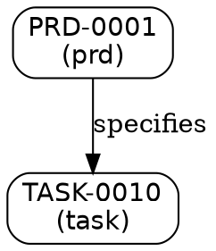

# How-To: Export Relational Knowledge Graph Subgraphs as Mermaid and DOT Diagrams

This guide explains how to extract, traverse, and render bounded subgraphs from the SpecOps relational knowledge graph into Mermaid and Graphviz DOT formats using `spec-ops graph mermaid`.

---

## Overview

SpecOps models all personas, PRDs, stories, tasks, ADRs, and tests as a version-locked relational knowledge graph. The `spec-ops graph mermaid` command exports subgraphs rooted at specific entities or the entire graph into:
- **Mermaid flowchart syntax** (`graph TD`, `flowchart TD|LR|TB|RL`): for direct embedding into Markdown documents, GitHub pull request briefs, and architectural documentation.
- **Graphviz DOT syntax** (`digraph { ... }`): for external rendering engines, visual graph tooling, and SVG/PDF export pipelines.

---

## Exporting the Full Relational Graph to Mermaid

To export the entire relational graph as a Mermaid flowchart to standard output:

```bash
uv run spec-ops graph mermaid
```

To specify diagram layout direction (`TD` top-down, `LR` left-to-right, `TB` top-to-bottom, `RL` right-to-left):

```bash
uv run spec-ops graph mermaid --direction LR
```

---

## Scoping Subgraphs by Root Entity and Traversal Depth

When analyzing dependencies or blast radiuses for a specific task, PRD, or ADR, scope the export to a neighborhood using `--root` and `--depth`:

```bash
uv run spec-ops graph mermaid --root TASK-0161 --depth 2
```

This performs a breadth-first search (BFS) starting at `TASK-0161`, traversing outward up to 2 hops across incoming and outgoing relationships.

---

## Exporting to Graphviz DOT Format

To export a subgraph in Graphviz DOT format:

```bash
uv run spec-ops graph mermaid --root PRD-0001 --depth 3 --format dot
```

Example DOT output:


---

## Saving Output Directly to a File

Use the `--output` (`-o`) option to write directly to a diagram file:

```bash
uv run spec-ops graph mermaid --root ADR-0007 --depth 2 --output docs/images/adr-0007-lineage.mmd
```

---

## Validating Graph Documentation

Exported diagrams follow clean syntax standards with sanitized labels and escaped special characters. To verify your documentation builds and CLI references remain in sync:

```bash
uv run spec-ops docs audit
uv run spec-ops docs build
```
